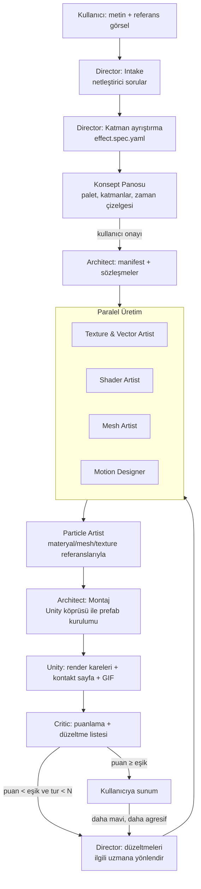

# Unity Effect Designer — Claude Code için VFX Ajan Stüdyosu

> Durum: **Tasarım taslağı (v0.1)** — değerlendirme ve karar için.

Kullanıcının betimlediği ya da referans görselle desteklediği bir efekti
("mor-altın renkli, önce içe çöken sonra patlayan bir büyü halkası") Unity
projesinde **çalışan, oynatılabilir, ayarlanabilir bir prefab** hâline getiren,
uzmanlaşmış ajanlardan oluşan bir "VFX stüdyosu".

---

## 1. Temel karar: Skill mi, Plugin mi?

**Cevap: Plugin.** Skill'ler ve ajanlar plugin'in *içinde* yaşar.

| Bileşen | Neden gerekli | Tek başına skill yeter mi? |
|---|---|---|
| **Subagent'lar** (`agents/*.md`) | Her uzmanın ayrı sistem promptu, ayrı araç yetkisi, ayrı bağlamı olmalı | Hayır |
| **Skill'ler** (`skills/*/SKILL.md`) | Shuriken modülleri, HLSL tarifleri, VFX teorisi gibi büyük bilgi paketleri *ihtiyaç anında* yüklenir; ajan bağlamları şişmez | Evet ama tek başına orkestrasyon yapamaz |
| **Komutlar** (`/vfx:create`, `/vfx:iterate` …) | Kullanıcının giriş noktası, orkestrasyon akışını tanımlar | Hayır |
| **MCP sunucusu** (Unity köprüsü) | Ajanların Unity'yi *görmesi ve kontrol etmesi*: derleme, prefab kurma, **render alma** | Hayır |
| **Hook'lar** | Shader yazılınca otomatik derle, SVG yazılınca otomatik rasterize et | Hayır |

Plugin tüm bunları tek paket olarak dağıtır; `/plugin install` ile kurulur.

> **Önemli mimari kısıt:** Claude Code'da subagent'lar başka subagent
> çağıramaz. Bu yüzden **orkestratör (Director) bir subagent değil**; ana
> oturumu yöneten `/vfx:create` komutu + `vfx-director` skill'idir. Uzmanları o
> çağırır, paralel çalıştırır, sonuçları birleştirir.

---

## 2. Ekip (Ajan Kadrosu)

### 2.1 Çekirdek ekip (MVP)

| # | Ajan | Rol | Ürettiği çıktı |
|---|---|---|---|
| 0 | **VFX Director** *(ana oturum)* | Brief'i yorumlar, referans görseli katmanlara ayırır, efekt spesifikasyonunu yazar, ekibi yönetir, son sözü söyler | `effect.spec.yaml` |
| 1 | **Systems Architect** | Paketin sistem tasarımı: klasör yapısı, isimlendirme, render pipeline tespiti, prefab hiyerarşisi, ajanlar arası **sözleşmeler** (shader property adları, vertex stream düzeni, texture kanal paketleme), runtime controller | `manifest.yaml`, `EffectController.cs`, asmdef |
| 2 | **Texture & Vector Artist** | SVG ile vektör çizim (halka, kıvılcım, slash, rune, yıldız), prosedürel doku (Perlin/Voronoi/FBM noise), gradient ramp/LUT, flipbook atlası, SDF | `.svg` → `.png`, noise, flipbook |
| 3 | **Shader Artist** | URP/HDRP/Built-in için HLSL/ShaderLab: dissolve, erosion, fresnel, UV scroll, distortion, soft particle, flipbook blend, vertex offset, additive/alpha-blend/premultiplied varyantları | `.shader`, `.hlsl`, material recipe |
| 4 | **Particle Artist** | Shuriken (ParticleSystem) uzmanı; ileride VFX Graph. Emisyon, şekil, ömür eğrileri, noise, trail, sub-emitter, custom vertex stream | `particle recipe (JSON)` |
| 5 | **VFX Critic (Görsel QA)** | Unity'den alınan render karelerini spec ve referansla karşılaştırır, puanlar, somut düzeltme listesi çıkarır | `review.md` + değişiklik listesi |

### 2.2 Genişletilmiş ekip (önerilen ek yetenekler)

| Ajan | Neden değerli |
|---|---|
| **Mesh Artist** | Stilize VFX'in (MOBA/ARPG tarzı) büyük kısmı mesh'tir: swirl, slash arc, koni, halka, şok dalgası, trail mesh. Python/C# ile prosedürel mesh (+UV düzeni) üretir. Sadece partikülle yapılan efektler "ucuz" görünür. |
| **Motion & Timing Designer** | Efektin *hissi* zamanlamadan gelir: anticipation → impact → dissipation. AnimationCurve'ler, easing, beat haritası; ayrıca **efekt dışı etkiler**: kamera sarsıntısı, ışık flaşı, bloom/chromatic pulse, hit-stop, ekran distorsiyonu. |
| **Performance Engineer** | Overdraw, partikül sayısı, shader instruction, batch sayısı, mobil bütçe; LOD varyantları üretir. "Güzel ama oyunu kasan" efekti engeller. |
| **Lighting & Post Artist** | Point light flicker, emissive/HDR renk kalibrasyonu, bloom eşiği ile uyum, Volume override'ları. |
| **Style Librarian (Hafıza)** | Projenin "stil İncili": palet, çizgi dili, daha önce onaylanmış efektler, kullanıcının tercihleri ("daha az duman sever"). Mevcut texture/shader'ları yeniden kullanır, tutarlılık sağlar. |
| **Audio Cue Designer** *(opsiyonel)* | Ses üretmez; efektin beat haritasına göre SFX tetik noktaları ve ses brief'i yazar. |

> Maliyet notu: Her ajan bir bağlam = token. Öneri, *çekirdek 5 + Mesh +
> Motion* ile başlamak; Performance ve Librarian'ı MVP-2'de eklemek.

---

## 3. Uçtan Uca Akış



### Fazlar

1. **Intake** — Director eksik bilgiyi sorar (en fazla 3–4 soru): efekt türü
   (tek seferlik / loop / projectile), 2D mi 3D mi, hedef platform, stil,
   oyun içi ölçek ve süre. Proje bilgisi (Unity sürümü, URP/HDRP, yüklü
   paketler) köprüden otomatik okunur — kullanıcıya sorulmaz.
2. **Ayrıştırma** — Referans görsel/brief katmanlara bölünür. Örn. *Ateş topu
   çarpması*: çekirdek flaş · şok dalgası halkası · kıvılcımlar · duman ·
   kor parçaları · zemin izi (decal) · ışık · kamera sarsıntısı.
3. **Konsept Panosu** — Üretime başlamadan önce kullanıcıya tek bir görsel
   sayfa: renk paleti, katman listesi, zaman çizelgesi (hangi katman ne zaman
   doğar/söner), şekil dili. *Pahalı üretimden önce yönü onaylatmak*,
   deneyimin "profesyonel stüdyo" hissini veren kısımdır.
4. **Sözleşmeler** — Architect, uzmanlar paralel çalışabilsin diye arayüzleri
   önceden sabitler (bkz. §5).
5. **Paralel üretim** — Texture, Shader, Mesh, Motion aynı anda; Particle
   Artist onların sözleşmedeki isimlerine referans vererek çalışır (gerekirse
   yer tutucu ile başlar).
6. **Montaj** — Köprü üzerinden: asset import, shader derleme, materyal
   oluşturma, recipe → ParticleSystem kurulumu, prefab kaydı.
7. **Render & Eleştiri** — Sabit kamera açılarından belirli zamanlarda kareler
   (ör. t = 0.0, 0.1, 0.25, 0.5, 1.0, 2.0 s), koyu ve açık arka plan,
   kontakt sayfa + GIF. Critic rubrikle puanlar (bkz. §7).
8. **İterasyon** — Critic'in listesi Director tarafından ilgili uzmana
   yönlendirilir; varsayılan en fazla 3 otomatik tur, sonra kullanıcıya sunum.
9. **Doğal dil ayarı** — "daha agresif", "sonu daha yumuşak sönsün", "biraz
   daha mor" gibi geri bildirim → parametre delta'larına çevrilir.

---

## 4. Unity Köprüsü — Ekibin Gözleri ve Elleri

Ajanların Unity'yi göremediği bir sistem kör üretim yapar. Kaliteyi
belirleyen tek en önemli bileşen **render alıp geri besleme döngüsü**dür.

```
Claude Code ──stdio──> MCP Sunucusu (TypeScript/Python)
                           │ HTTP/WebSocket (localhost)
                           ▼
                 Unity Editor Paketi (C#, com.effectdesigner.bridge)
```

### MCP araçları (taslak)

| Araç | İşlev |
|---|---|
| `unity_project_info` | Unity sürümü, render pipeline, renk uzayı, yüklü paketler (VFX Graph, Shader Graph) |
| `unity_refresh` | AssetDatabase refresh/import |
| `unity_compile_shader` | Shader'ı derler, hata/uyarıları satır numarasıyla döner |
| `unity_apply_material_recipe` | JSON → Material (shader, property, keyword, render queue) |
| `unity_apply_particle_recipe` | JSON → ParticleSystem hiyerarşisi (tüm modüller) |
| `unity_import_mesh` / `unity_import_texture` | Import ayarlarıyla (sRGB, wrap, mip, sprite mode, flipbook) |
| `unity_build_prefab` | Hiyerarşiyi prefab olarak kaydet |
| `unity_render_preview` | Önizleme sahnesinde efekti oynat, verilen zamanlarda/açılarda PNG kareler + GIF döndür |
| `unity_profile_effect` | Maks. partikül sayısı, overdraw görünümü render'ı, draw call, shader varyant sayısı |
| `unity_console` | Konsol hatalarını oku |
| `unity_run_editor_method` | Kaçış kapısı: özel editor script çalıştır |

### Kritik tasarım kararı: **Deklaratif recipe → güvenilir builder**

Ajanlar `.prefab`/`.mat`/`.vfx` YAML'ını **elle yazmaz** (kırılgan, GUID
cehennemi). Bunun yerine:

- Particle Artist **JSON recipe** yazar (şema ile doğrulanır),
- köprüdeki tek ve iyi test edilmiş C# builder onu ParticleSystem'e çevirir.

Faydaları: şema doğrulaması, küçük diff'ler, iterasyonda sadece parametre
yaması, versiyon kontrolü dostu, LLM'in en iyi olduğu şey olan *yapılandırılmış
veri* üretimi.

Shader'lar ise **kod** olarak yazılır (HLSL, LLM için doğal). Shader Graph
desteği şablon tabanlı olarak sonraya bırakılır (JSON'u kırılgan).

### Mevcut açık kaynak köprüler

Topluluğun Unity MCP projeleri var (ör. `justinpbarnett/unity-mcp`,
`CoderGamester/mcp-unity`). Genel amaçlı editor kontrolü için temel alınabilir
ya da ilham kaynağı olabilir; ancak **render yakalama, recipe builder ve
profiling** bizim farkımız ve kendimiz yazmalıyız. (Karar noktası — §10.)

### Çalışma ortamı notu

Köprü, Unity Editor'ün **açık olduğu makinede** çalışan Claude Code gerektirir
(yerel CLI / masaüstü uygulaması). Unity `-batchmode -nographics` render
alamaz; headless/CI modu için GPU'lu batchmode + `-executeMethod` yedek yol
olarak planlanır.

---

## 5. Veri Sözleşmeleri

### 5.1 `effect.spec.yaml` (Director → herkes)

```yaml
id: arcane_nova_impact
archetype: impact            # projectile | impact | aura | beam | portal | buff | pickup | ...
style: stylized_hand_painted
platform: pc                 # pc | console | mobile
pipeline: urp                # köprüden otomatik
duration: 1.6                # saniye
loop: false
scale_meters: 3.0
palette:
  core:   "#FFF4D6"
  primary: "#9B5CFF"
  accent:  "#FFC247"
  shadow:  "#2A0F4F"
beats:                       # hissin iskeleti
  - { t: 0.00, name: anticipation, note: "içe çeken parçacıklar, ışık kısılır" }
  - { t: 0.35, name: impact,       note: "beyaz flaş + halka + kamera sarsıntısı" }
  - { t: 0.60, name: dissipation,  note: "kıvılcımlar yavaşlar, duman kıvrılır" }
layers:
  - id: core_flash
    role: impact
    window: [0.35, 0.50]
    technique: particle_billboard
    needs: { texture: soft_glow_star, shader: vfx_additive_flipbook }
  - id: shockwave
    role: impact
    window: [0.35, 0.80]
    technique: mesh_ring
    needs: { mesh: ring_flat, texture: ring_noise_mask, shader: vfx_erosion_distort }
  - id: sparks
    role: secondary
    window: [0.36, 1.20]
    technique: particle_stretched
    count_hint: 40
  # ...
extras:
  camera_shake: { t: 0.35, amplitude: 0.25, duration: 0.3 }
  light: { color: "#B889FF", peak_intensity: 8, curve: impact_spike }
references:
  - path: refs/user_ref_01.png
    notes: "halkanın kırık-parçalı kenarı buradan"
```

### 5.2 `manifest.yaml` (Architect → uzmanlar)

Paralel üretimin anahtarı. Örnekler:

- **İsimlendirme:** `VFX_<EffectId>_<Layer>`, `T_<Id>_<Name>`, `M_…`, `SH_…`
- **Klasör:** `Assets/VFX/<EffectId>/{Textures,Shaders,Materials,Meshes,Prefabs}`
- **Texture kanal paketleme:** `R = şekil maskesi, G = noise, B = erosion ramp, A = alfa`
- **Shader property sözleşmesi:** `_MainTex, _TintColor (HDR), _Erosion, _ScrollSpeed, _DistortStrength …`
- **Custom vertex stream sözleşmesi** (Particle ↔ Shader):
  `TEXCOORD0.xy = UV, TEXCOORD0.zw = Custom1.xy (erosion, emissive boost), TEXCOORD1.x = AgeFraction`
- **Runtime API:** `EffectController.Play(intensity, tint)`, `Stop(fade)`, pool uyumluluğu, çarpma normali/ölçek parametreleri

### 5.3 Particle recipe (kısaltılmış örnek)

```json
{
  "name": "VFX_ArcaneNova_Sparks",
  "main": { "duration": 1.0, "loop": false, "startLifetime": [0.4, 0.8],
            "startSpeed": [6, 12], "startSize": [0.04, 0.09],
            "startColor": { "gradient": "palette.accent->palette.core" },
            "simulationSpace": "World", "gravityModifier": 0.6 },
  "emission": { "bursts": [ { "time": 0.36, "count": [30, 45] } ] },
  "shape": { "type": "Sphere", "radius": 0.2 },
  "velocityOverLifetime": { "speedModifier": { "curve": "ease_out_expo" } },
  "sizeOverLifetime": { "curve": [[0,1],[0.7,0.8],[1,0]] },
  "renderer": { "mode": "Stretch", "velocityScale": 0.08,
                "material": "M_ArcaneNova_Spark",
                "customVertexStreams": ["Position","Color","UV","Custom1.xy"] }
}
```

---

## 6. Uzman Detayları

### Texture & Vector Artist
- **Vektör:** SVG yazar → `resvg`/`cairosvg` ile PNG (2'nin kuvveti boyut,
  premultiplied alfa kontrolü). Tipik şekiller: yumuşak glow, 4/6 kollu yıldız,
  kırık halka, slash yayı, rune/sembol, damla, kıvılcım çizgisi.
- **Prosedürel:** Python (numpy) ile tileable Perlin/Simplex/Voronoi/FBM,
  domain warp, erosion ramp, gradient LUT.
- **Flipbook:** Kare dizisi üret → atlas'a paketle (ör. 4×4, 8×8) + import
  ayarlarını manifest'e yaz.
- **Kalite kontrol:** Kenar taşması, tile dikişi, alfa halo'su kontrolü; kendi
  çıktısının küçük önizlemesini görsel olarak inceler.

### Shader Artist
- Ortak `VFXCore.hlsl` kütüphanesi: soft particle, flipbook blend, polar UV,
  UV distort, erosion step/smoothstep, fresnel, HDR tint, dither fade.
- Pipeline'a göre varyant (URP önce). Blend modları: Additive, Alpha,
  Premultiplied, Multiply.
- Her shader yazımından sonra hook ile derleme; hata varsa otomatik düzeltme.
- Mobil için `half` hassasiyet, keyword sayısı sınırlaması.

### Particle Artist
- Shuriken'in tüm modüllerine hâkim skill paketi (modül referansı + "tarifler":
  kıvılcım, duman, kor, toz, sihirli toz, yağmur, kan, enerji akışı).
- Sub-emitter (ölüm/çarpışma), trail, noise, limit velocity, collision.
- Custom vertex stream ile shader'a veri taşıma (sözleşmeye uygun).
- MVP-3: VFX Graph (GPU) — şablon grafik + exposed property yaklaşımı.

### Mesh Artist
- Prosedürel mesh üretimi (Python → OBJ/FBX veya C# `Mesh` API): düz halka,
  koni, swirl/tornado, slash yayı, yarım küre, ribbon. **UV düzeni efekte
  göre tasarlanır** (ör. halka için U = çevre, V = yarıçap → erosion ve scroll
  doğal çalışır).

### Motion & Timing Designer
- Beat haritasından tüm eğrileri türetir (boyut, alfa, emisyon, ışık, erosion).
- Easing kütüphanesi (expo-out patlamalar, back-in anticipation).
- Kamera sarsıntısı (Cinemachine Impulse varsa), ışık eğrisi, Volume pulse,
  opsiyonel hit-stop.

### VFX Critic
- Sadece spec'e değil **VFX temel ilkelerine** göre de değerlendirir: okunurluk
  (silüet), değer kontrastı, zamanlama ritmi, şekil dili tutarlılığı, renk
  uyumu, "ucuz görünme" işaretleri (tekdüze boyut, sabit hız, düz alfa sönmesi).

---

## 7. Kalite Döngüsü (Critic Rubriği)

| Kriter | Ağırlık | Ölçüm |
|---|---|---|
| Spec / referansa sadakat | 25 | Katmanlar var mı, palet tutuyor mu, referansla benzerlik |
| Okunurluk & silüet | 15 | Koyu ve açık arka planda, küçük boyutta seçilebilir mi |
| Zamanlama & his | 20 | Beat'ler doğru mu, anticipation/impact/dissipation hissediliyor mu |
| Şekil & renk ustalığı | 15 | Değer kontrastı, renk geçişleri, şekil çeşitliliği |
| Teknik temizlik | 10 | Derleme hatası yok, alfa halo yok, sorting problemi yok |
| Performans | 15 | Platform bütçesine uygun mu (`unity_profile_effect`) |

- **Eşik:** ≥ 80 → kullanıcıya sun; < 80 → düzeltme turu (maks. 3).
- Critic çıktısı serbest metin değil, **yönlendirilebilir düzeltme listesi**:
  `{ owner: shader-artist, layer: shockwave, issue: "..", suggestion: ".." }`.
- Hareketi görebilmek için: kare şeridi + GIF + katman başına alfa/boyut eğrisi
  grafiği.

---

## 8. Kullanıcı Deneyimi — "Başlı Başına İyi Hissettirmesi" İçin

1. **Konsept panosu önce** — Palet swatch'ları, katman diyagramı, zaman
   çizelgesi. Kullanıcı daha tek asset üretilmeden "evet, bu" der.
2. **Üç yön (A/B/C)** — `/vfx:explore` ile aynı brief'ten üç farklı yorum
   (örn. zarif / agresif / kaotik) küçük thumbnail'larla; kullanıcı seçer.
3. **Canlı ilerleme** — Görev listesi: "Texture Artist: 4/6 doku", "Shader:
   derlendi ✓".
4. **Sonuç paketi** — Kontakt sayfa, GIF, katman dökümü, performans raporu,
   kullanılan dosyaların listesi.
5. **Sanatçı dostu kontrol** — `EffectController` üzerinde özel inspector:
   *Intensity, Tint, Scale, Speed, Duration* slider'ları; tasarımcı ajana
   dönmeden ince ayar yapabilir.
6. **Doğal dil ayarı** — `/vfx:iterate "sonu daha yumuşak, kıvılcımlar daha
   az"` → sadece ilgili recipe/parametre yamalanır.
7. **Varyant üretimi** — `/vfx:variant --element ice` → aynı efektin buz/zehir/
   kutsal versiyonları (palet + şekil dili dönüşümü, sistem aynı kalır).
8. **Her tur bir commit** — Git ile iterasyon geçmişi; "2 tur önceki daha
   iyiydi" dendiğinde geri dönülebilir.
9. **Arketip kütüphanesi** — Projectile, impact, aura, beam, portal, buff,
   heal, pickup, magic circle, weather, UI sparkle… Her biri kanıtlanmış bir
   katman şablonu; sıfırdan başlamak yerine iyi bir iskeletten başlanır
   (kaliteyi en çok artıran şeylerden biri).

---

## 9. Plugin Dizin Yapısı

```
unity-vfx-designer/
├── .claude-plugin/
│   └── plugin.json
├── commands/
│   ├── create.md          # /vfx:create "<brief>" [--ref img]  — ana orkestrasyon
│   ├── explore.md         # /vfx:explore  — A/B/C yönleri
│   ├── iterate.md         # /vfx:iterate "<geri bildirim>"
│   ├── variant.md         # /vfx:variant --element ice
│   ├── review.md          # /vfx:review   — mevcut bir efekti eleştir
│   └── optimize.md        # /vfx:optimize --platform mobile
├── agents/
│   ├── vfx-architect.md
│   ├── texture-artist.md
│   ├── shader-artist.md
│   ├── particle-artist.md
│   ├── mesh-artist.md
│   ├── motion-designer.md
│   ├── vfx-critic.md
│   └── perf-engineer.md
├── skills/
│   ├── vfx-director/            # orkestrasyon protokolü, spec yazımı
│   ├── vfx-fundamentals/        # zamanlama, şekil dili, renk, okunurluk
│   ├── effect-archetypes/       # arketip şablonları
│   ├── shuriken-reference/
│   ├── vfxgraph-reference/
│   ├── urp-vfx-shaders/         # HLSL tarif kitabı + VFXCore.hlsl
│   ├── hdrp-vfx-shaders/
│   ├── texture-authoring/       # SVG kalıpları, noise tarifleri, kanal paketleme
│   ├── procedural-meshes/
│   └── platform-budgets/
├── hooks/
│   └── hooks.json               # *.shader → derle, *.svg → rasterize, recipe → şema doğrula
├── schemas/
│   ├── effect-spec.schema.json
│   ├── manifest.schema.json
│   ├── particle-recipe.schema.json
│   └── material-recipe.schema.json
├── tools/                       # Python yardımcıları
│   ├── svg_rasterize.py
│   ├── noise_gen.py
│   ├── flipbook_pack.py
│   ├── mesh_gen.py
│   └── contact_sheet.py
├── mcp/
│   └── unity-bridge/            # MCP sunucusu
└── unity-package/
    └── com.effectdesigner.bridge/
        ├── Editor/              # HTTP sunucu, recipe builder'lar, render yakalama, profiler
        └── Runtime/             # EffectController, pool arayüzü
```

### Örnek ajan tanımı

```markdown
---
name: shader-artist
description: Unity VFX shader uzmanı. URP/HDRP/Built-in için HLSL/ShaderLab
  efekt shader'ları yazar (dissolve, erosion, distortion, flipbook, fresnel).
  manifest.yaml'daki property ve vertex stream sözleşmesine uyar.
tools: Read, Write, Edit, Glob, Grep, mcp__unity-bridge__unity_compile_shader,
  mcp__unity-bridge__unity_apply_material_recipe
skills: urp-vfx-shaders, vfx-fundamentals
---
Sen kıdemli bir VFX teknik sanatçısısın...
(1) effect.spec.yaml ve manifest.yaml'ı oku
(2) Her katman için gereken shader'ı VFXCore.hlsl üzerine kur
(3) Derle, hata varsa düzelt; derlenmeyen shader teslim etme
(4) Material recipe'lerini yaz
(5) Director'a kısa özet + sözleşmeden sapma varsa gerekçesi
```

### Model dağılımı
- **Director, Critic, Architect:** en güçlü model (yargı ve görsel analiz).
- **Shader, Particle, Mesh, Motion:** güçlü/orta model.
- **Texture yardımcı işleri, şema doğrulama:** hızlı/ucuz model.

---

## 10. Yol Haritası

| Faz | Kapsam | Başarı kriteri |
|---|---|---|
| **MVP-1** | Unity köprüsü (compile, recipe builder, **render yakalama**), Architect, Texture&Vector, Shader (URP HLSL), Particle (Shuriken), Critic, 4 arketip (impact, projectile, aura, pickup) | "Mor bir büyü çarpması" brief'inden 3 tur içinde kabul edilebilir, çalışan prefab |
| **MVP-2** | Mesh Artist, Motion Designer (kamera/ışık), Performance Engineer, konsept panosu, `/vfx:iterate`, `/vfx:variant` | Stilize MOBA kalitesine yaklaşan katmanlı efektler; mobil bütçe raporu |
| **MVP-3** | VFX Graph, Shader Graph şablonları, HDRP, Style Librarian (proje hafızası), `/vfx:explore` A/B/C | Proje stilini öğrenen, tutarlı efekt setleri üreten stüdyo |

---

## 11. Riskler

| Risk | Azaltma |
|---|---|
| LLM'in hareketi statik karelerden yargılaması zor | Yoğun kare şeridi + GIF + eğri grafikleri; zamanlama kararları Motion Designer'ın sayısal beat haritasına dayanır |
| Unity YAML/GUID kırılganlığı | Deklaratif recipe + C# builder; ham YAML yazımı yasak |
| VFX Graph / Shader Graph dosya formatları kırılgan | Şablon + exposed property; MVP-3'e ertelendi |
| Token maliyeti (çok ajan, çok tur) | Skill'lerle ihtiyaç anında bilgi yükleme; tur limiti; ucuz model yardımcı işlerde; sadece değişen katmanın yeniden üretimi |
| Editor açık olmadan render yok | Yerel çalışma şartı; GPU'lu batchmode yedeği |
| Renk uzayı / HDR tutarsızlığı | Köprü Linear/Gamma ve HDR ayarını okur, spec renkleri buna göre dönüştürülür |

---

## 12. Karar Bekleyen Sorular

1. **Hedef Unity sürümü ve pipeline?** (Öneri: Unity 6 + URP ile başla.)
2. **Partikül önceliği: Shuriken mi, VFX Graph mı?** (Öneri: Shuriken — mobil
   dahil her yerde çalışır, API'si script ile tam kurulabilir.)
3. **2D (sprite/UI efektleri) de kapsamda mı?**
4. **Unity köprüsü:** sıfırdan mı yazalım, mevcut bir açık kaynak Unity MCP
   üzerine mi kuralım?
5. **Stil hedefi:** stilize (el boyaması/anime/MOBA) mı, gerçekçi mi, ikisi de mi?
